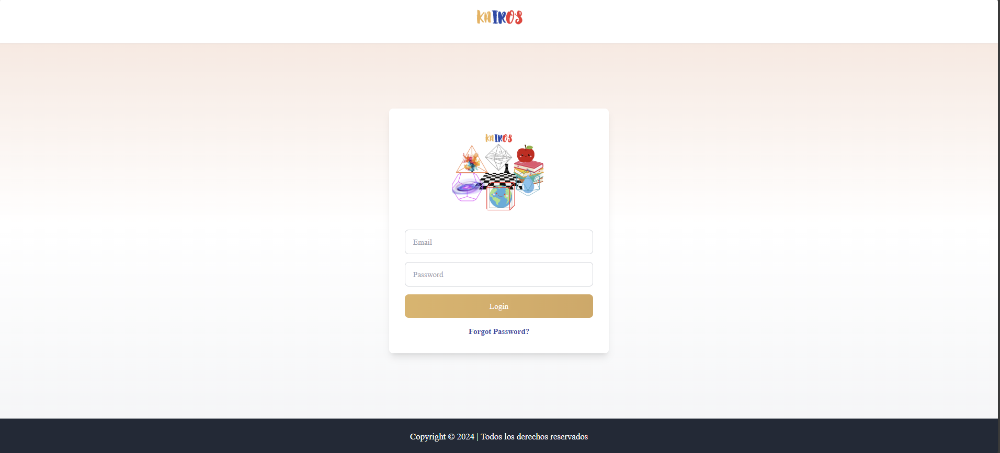
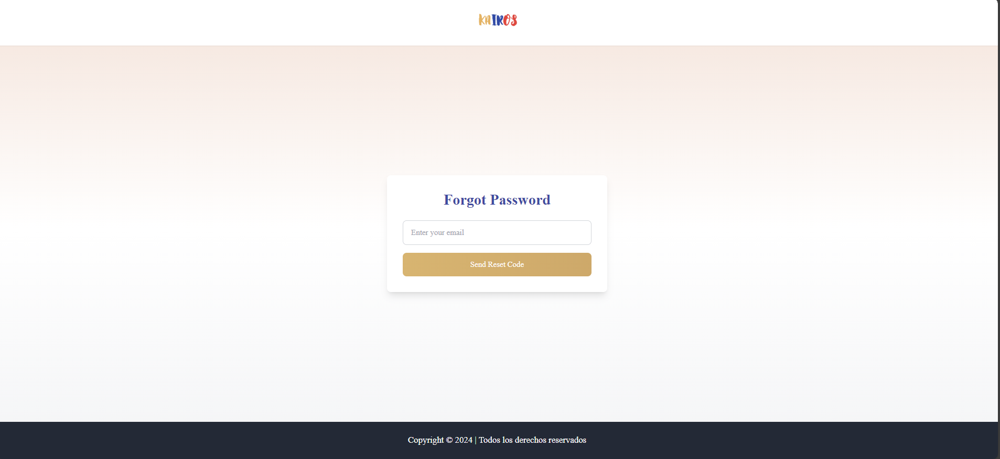
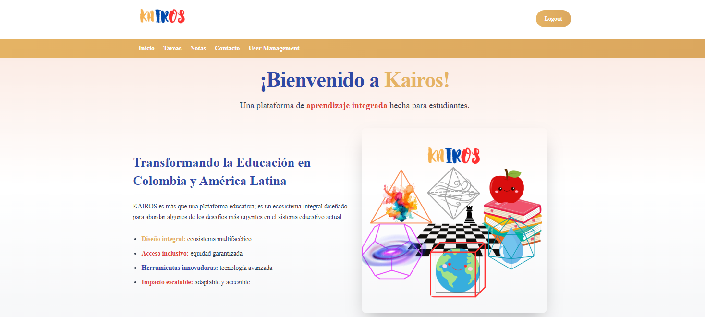
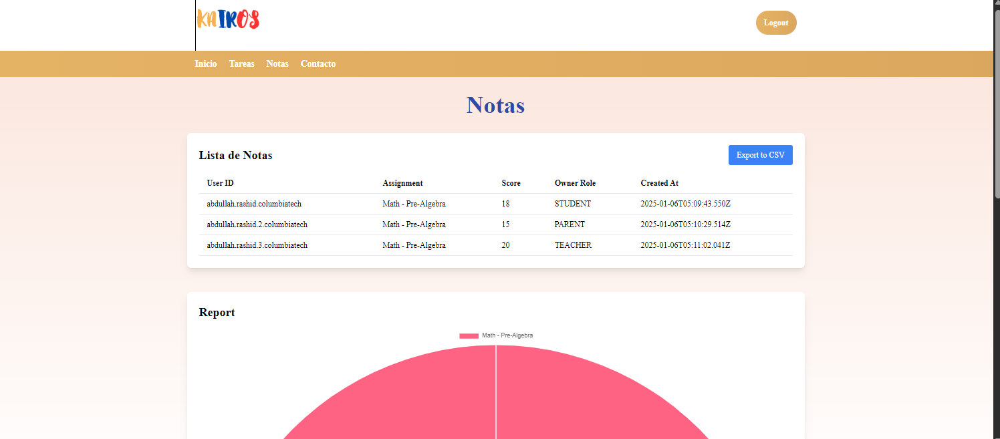
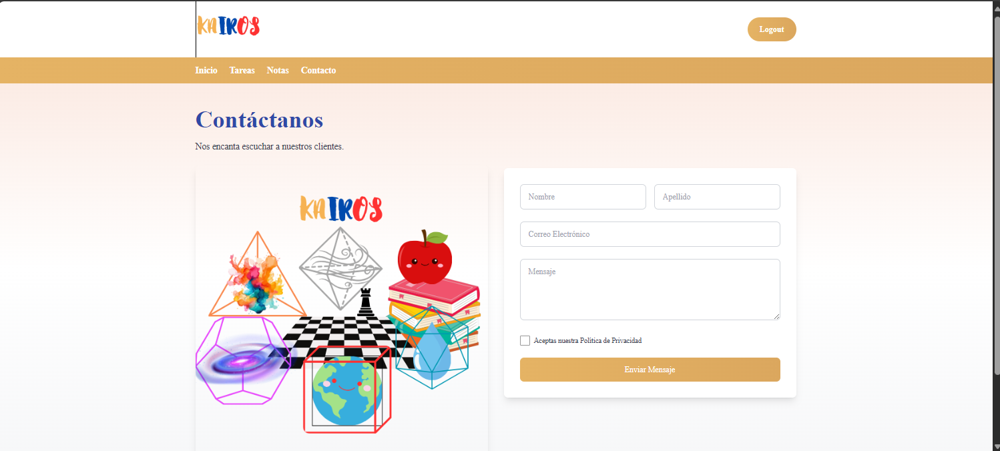
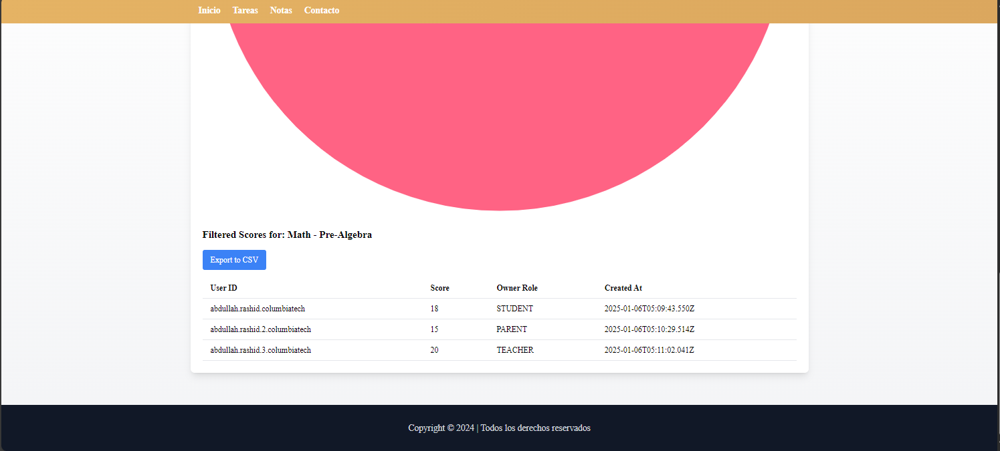

# AWS React Application with Amplify, DynamoDB, Cognito, and Tailwind CSS

This repository showcases a robust React application leveraging AWS services and modern technologies like TypeScript and Tailwind CSS. The project emphasizes key aspects of cloud-based application development and UI/UX design principles, incorporating AWS Amplify, DynamoDB, Cognito, and AppSync.

## Project Highlights

### Technologies Used:

- **React & TypeScript**: For building a scalable and maintainable front-end application.
- **Tailwind CSS**: To create responsive and visually appealing designs efficiently.
- **AWS Amplify**: Simplifying deployment and backend integration.
- **AWS DynamoDB**: For a scalable NoSQL database solution.
- **AWS Cognito**: For secure authentication and user management.
- **AWS AppSync**: For building robust GraphQL APIs.
- **AWS Management Console**: To manage and monitor cloud resources effectively.

## Learning Objectives

This project demonstrates proficiency in:

1. **React Development**:
   - Building reusable components.
   - Managing state effectively.
2. **JavaScript & TypeScript**:
   - Writing type-safe and clean code.
   - Leveraging TypeScript interfaces and types.
3. **Tailwind CSS**:
   - Rapid UI development.
   - Ensuring a consistent design system.
4. **AWS Services**:
   - Setting up and managing DynamoDB tables.
   - Configuring user authentication with AWS Cognito.
   - Deploying a GraphQL API using AppSync.
   - Integrating Amplify for seamless backend connections.
5. **Cloud Management**:
   - Navigating the AWS Management Console for monitoring and optimization.

## Screenshots

### Login Page

**Highlights**: AWS Cognito-powered authentication with a clean, Tailwind CSS-based UI.

### Forgot Password Page

**Highlights**: Secure password reset functionality using AWS Cognito.

### Home Page

**Highlights**: Dynamic data fetched from AWS AppSync GraphQL API.

### Scores Page

**Highlights**: Data storage and retrieval from DynamoDB, with export functionality.

### Contact Page

**Highlights**: Form validation and API integration for user messages.

### Dynamic Filtering

**Highlights**: Interactive UI powered by React state management and Tailwind.

## Key Features

- **Authentication**: Secure user sign-up, login, and password reset flows using AWS Cognito.
- **Dynamic Data**: Real-time interactions with DynamoDB through AppSync GraphQL API.
- **Responsive Design**: Tailwind CSS ensures the application looks great on all devices.
- **Export Functionality**: Downloadable reports in CSV format.

## How to Run

1. Clone the repository:
   ```bash
   git clone https://github.com/your-repo-name.git
   ```
2. Install dependencies:
   ```bash
   npm install
   ```
3. Configure Amplify:
   ```bash
   amplify init
   amplify push
   ```
4. Start the application:
   ```bash
   npm start
   ```

## Challenges & Learnings

- **React Development**: Improved understanding of React hooks and component reusability.
- **TypeScript**: Enhanced type-safety and error handling.
- **AWS Integration**: Learned to set up and integrate multiple AWS services for a seamless application.
- **Tailwind CSS**: Mastered building responsive layouts efficiently.
- **Cloud Optimization**: Gained insights into cost-effective management of AWS resources.

## Conclusion

This project exemplifies the power of combining React, TypeScript, and AWS services to build a scalable, secure, and user-friendly application. It highlights my ability to integrate front-end and backend technologies while ensuring a great user experience.

Feel free to explore the code and provide feedback! 🚀
